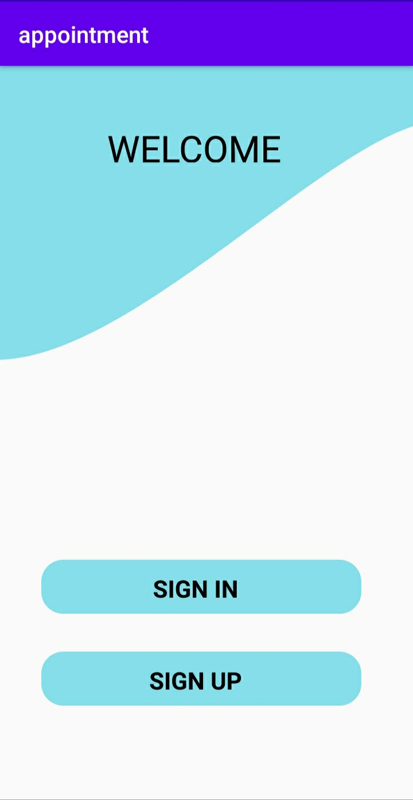
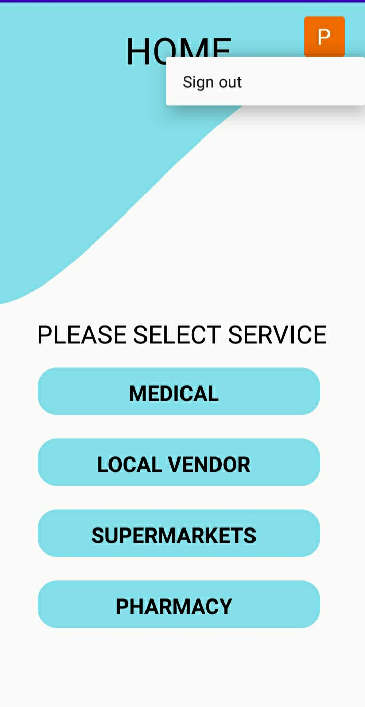
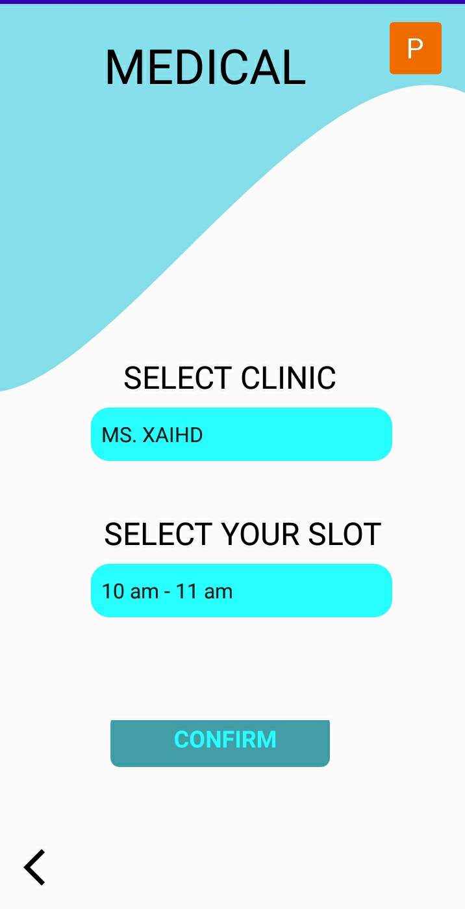

# User Application

The application allows users to book appointments with various service providers like
* Local vendors
* Doctor's 
* Supermarket 
* Pharmacy

## App Flow
On pressing the sign in or sign up button the function *loginClick* is called which initiates an instance of IBM's App ID for authenticaction. 
 

If the authentication is successfull the user is redirected to the home page where the user can choose the service provider he wants to book an appointment with. 
 

From this page the user can select which service provider does he want to book an appointment for by selecting the slot and the name of the provider.

### UI/UX by
* [M V Anvay Reddy](https://github.com/Anvay-Reddy)

### Made by
* [Pulkit Mahajan](https://github.com/pulkitmahajan23)